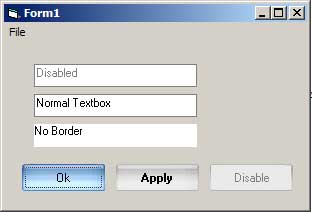



## Ultimate One Line Application Skin

### Description

A Skin Library that soo easy to use, just add a reference to it and one line of code to your Sub Main and that's it the whole application get skinned.

No need for OCX or redesign all of your forms.

Don't forget to read the Readme.txt for additional features and instruction on how to run the project.

Special thanks to Paul Caton for his great works on ASM Hook and Subclass, also for Vlad Visoultchev for his similar ASM thunks and XP Colors reproduction.

Enjoy.
 
### More Info
 

             |
---                |---
**Submitted On**   |2004-10-11 13:27:44
**By**             |[Luthfi M](https://github.com/Planet-Source-Code/PSCIndex/blob/master/ByAuthor/luthfi-m.md)
**Level**          |Advanced
**User Rating**    |5.0 (75 globes from 15 users)
**Compatibility**  |VB 6\.0
**Category**       |[Libraries](https://github.com/Planet-Source-Code/PSCIndex/blob/master/ByCategory/libraries__1-49.md)
**World**          |[Visual Basic](https://github.com/Planet-Source-Code/PSCIndex/blob/master/ByWorld/visual-basic.md)
**Archive File**   |[Ultimate\_O18045610122004\.zip](https://github.com/Planet-Source-Code/luthfi-m-ultimate-one-line-application-skin__1-56706/archive/master.zip)

